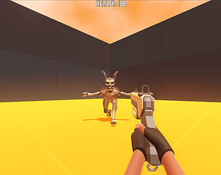

# Protoype Shooter from Marks shooter

using this to learn all the mechanics 

I learned a lot from the [Godot-4-fpsarms](https://github.com/gdquest-demos/godot-4-FPS-arms) demo

## Controls:
* WASD - Movement
* R - Reload
* Space - Jump
* Shift - Sprint
* Ctrl - Crouch
* Sprint+Crouch - Slide

## Save File
I use a Godot resource to save data for the player.
You can load the saved data statically using:\
	`var player_save: PlayerSave = PlayerSave.load_player_data()`

Add any export variables you wish to store, and then save using:\
	`player_save.save_player_data(player_save)`

